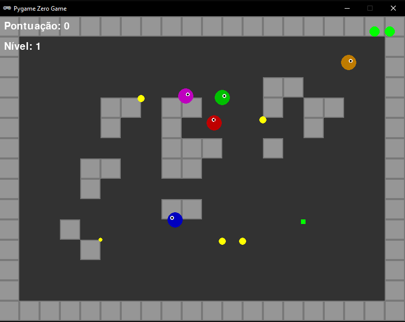

# Desafio KodeLand



## 🎮 Sobre o Jogo

KodeLand é um jogo de aventura 2D desenvolvido com Pygame Zero onde você controla um personagem que precisa coletar itens enquanto evita inimigos em um labirinto. O jogo apresenta diferentes tipos de inimigos, cada um com comportamentos únicos, e um sistema de pontuação baseado nos itens coletados.

## ✨ Características

- **Mapa Dinâmico**: Labirinto gerado aleatoriamente a cada partida
- **Inimigos Variados**: Quatro tipos diferentes de inimigos com comportamentos únicos
- **Sistema de Itens**: Colete itens para aumentar sua pontuação
- **Efeitos Sonoros**: Música de fundo e efeitos sonoros para uma experiência imersiva
- **Interface Amigável**: Menu intuitivo e HUD informativo durante o jogo

## 🚀 Como Jogar

1. Certifique-se de ter o Python e o Pygame Zero instalados
2. Clone este repositório
3. Execute o jogo com o comando:

```bash
python main.py
```

### Controles

- **Setas**: Movimentam o personagem
- **Espaço**: Ação especial (quando disponível)
- **Enter**: Confirmar seleções no menu
- **Esc**: Pausar/Voltar ao menu

## 🛠️ Requisitos

- Python 3.6 ou superior
- Pygame Zero (`pip install pgzero`)

## 📂 Estrutura do Projeto

- `main.py`: Ponto de entrada do jogo
- `game.py`: Lógica principal do jogo
- `characters.py`: Classes para o jogador e inimigos
- `items.py`: Sistema de itens coletáveis
- `map.py`: Geração e renderização do mapa
- `ui.py`: Interface do usuário (menus, HUD)
- `audio.py`: Sistema de áudio e efeitos sonoros
- `constants.py`: Constantes globais do jogo
- `game_state.py`: Gerenciamento do estado do jogo
- `images/`: Sprites e recursos visuais
- `music/`: Arquivos de música de fundo
- `sounds/`: Efeitos sonoros

## 🤝 Contribuindo

Contribuições são bem-vindas! Sinta-se à vontade para abrir um issue ou enviar um pull request com melhorias.

Desenvolvido com ❤️ para o Desafio KodeLand